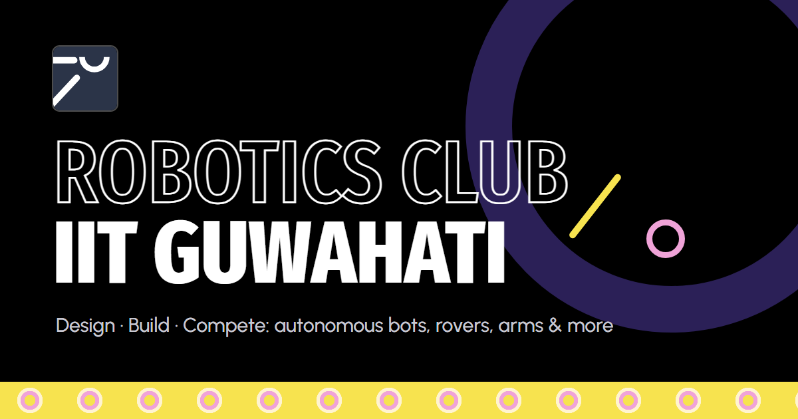

<p align="center">
  
</p>

# Robotics Club · IIT Guwahati: Website

The official website of the **Robotics Club, IIT Guwahati**: projects, announcements,
achievements, team, gallery and learning resources.

It is a plain **HTML + CSS + JavaScript** static site. There is **no build step and no
dependencies**, so anyone in the club can edit it, and it runs on any static host
(GitHub Pages, Netlify, Vercel or the institute server).

---

## ✨ Features

- **Animated hero**: the club's Mars rover crosses endless dunes and zaps approaching aliens (click to fire)
- **Projects** with filters and a dedicated **deep-dive page** for every project
- **Events & Updates**: the 3 latest events + what's next, an interactive month calendar with every event, and a details pop-up for each (poster, dates, venue, links, add to Google Calendar); plus a moving carousel of flagship events
- **Announcements** page with pinned posts, "New" badges and filters
- **Hall of Fame** showcase with medal tally, auto-rotating highlights and a full timeline
- **Leadership** portrait grid on the home page and a full **Team** page (photos from `images/team/`)
- **Gallery** mosaic with a keyboard-friendly lightbox
- **Resources**: searchable learning material, the club archive and an inventory request list
- **Contact** form (opens the visitor's email app, no backend needed)
- Responsive down to 360 px, keyboard accessible, and respects `prefers-reduced-motion`

## 🗂 Project structure

```
.
├── index.html            Home: hero, about, events & updates, explore, hall of fame, leadership, contact
├── projects.html         All projects (filterable)
├── project.html          Project deep-dive (project.html?id=<project-id>)
├── achievements.html     Hall of fame: photo collage, click to enlarge
├── team.html             Core team
├── gallery.html          All photos
├── resources.html        Learning material + inventory
├── 404.html              Not-found page
│
├── content/              ← ALL SITE CONTENT (one JSON file per section)
├── admin/                Site editor (Sveltia CMS): config.yml + sign-in page (index.html + gate.js)
├── js/
│   ├── data.js           Loads content/*.json into the pages
│   ├── common.js         Shared header/footer (nav links in PAGES), helpers
│   ├── main.js           Renders each page's sections + Mars hero scene
│   ├── project.js        Project deep-dive page
│   └── icons.js          SVG icon set
├── css/style.css         Theme and layout (css/fonts.css: the self-hosted fonts)
├── fonts/                Font files, stored here so the site needs no Google Fonts
├── images/               Logo, social preview image, photos (images/old-site/: photos copied from the old iitg.ac.in club page)
├── materials/            Downloadable PDFs (install guides, selection task)
├── scripts/validate.mjs  Content checker (runs in CI)
└── .github/workflows/    Check + deploy to GitHub Pages
```

## 🚀 Run locally

Any static server works. The simplest, with Python:

```bash
c
```

Then open <http://localhost:5173>.

> Opening `index.html` directly from disk mostly works, but a local server is closer to production.

## ✏️ Updating content

**You almost never need to touch HTML.** Every project, announcement, team member, photo and
link is in [`content/`](content/) (one JSON file per section). Club members edit it through the
**site editor at `/admin`**, with no coding and a GitHub login; see **[EDITORS.md](EDITORS.md)**. Developers can edit the
JSON directly; see **[CONTRIBUTING.md](CONTRIBUTING.md)** for
copy-paste examples (add a project, post an announcement, change the team, add photos).

Before pushing, check your edits:

```bash
node scripts/validate.mjs
```

It reports duplicate project ids, broken references, malformed dates, missing files and any
placeholder entries still marked `sample: true`.

## 🌐 Deploying (GitHub Pages)

The workflow in [`.github/workflows/deploy.yml`](.github/workflows/deploy.yml) checks the site on
every push. **Publishing is currently manual:** it only deploys when started from
**Actions → Check & deploy → Run workflow**. (To go back to deploying on every push, change the
`deploy` job's `if:` to `github.event_name != 'pull_request' && github.ref == 'refs/heads/main'`.)

1. Create an empty repository on GitHub (e.g. under the club org
   [`RCIITG`](https://github.com/RCIITG)). Don't add a README or license there.
2. Push this folder:
   ```bash
   git remote add origin https://github.com/<owner>/<repo>.git
   git push -u origin main
   ```
3. On GitHub: **Settings → Pages → Build and deployment → Source: GitHub Actions**.
4. Open the **Actions** tab and wait for *Check & deploy* to go green. The site is live at
   `https://<owner>.github.io/<repo>/`.

**Custom domain (optional):** add a file named `CNAME` containing just the domain
(e.g. `roboclub.example.org`), point the domain's DNS at GitHub Pages, and enable
*Enforce HTTPS* in Settings → Pages.

**Other hosts:** Netlify, Vercel or Cloudflare Pages: import the repo with no build command and
publish directory `/`. For the institute server, upload the files as they are.

After going live, change `og:image` in each page's `<head>` to the full URL
(`https://…/images/og-image.png`) so link previews show the image everywhere.

## 📌 Known TODOs

- Entries marked `sample: true` in `content/*.json` are placeholders (recent announcements,
  inventory list). Replace them with real details.
- Project and event photos currently load from the old site (`iitg.ac.in/sa/roboclub/img/`).
  Copy them into `images/` and update the paths so the site doesn't depend on the old server.
- Add team headshots to `images/team/` (file names listed in [`images/team/README.md`](images/team/README.md)).

## 🤝 Contributing

Pull requests are welcome, especially new projects, results and photos.
Read [CONTRIBUTING.md](CONTRIBUTING.md) first.

## 📄 License

Code is released under the [MIT License](LICENSE). Club name, logo, photos and written content
are © Robotics Club, IIT Guwahati, and are not covered by the code license.
